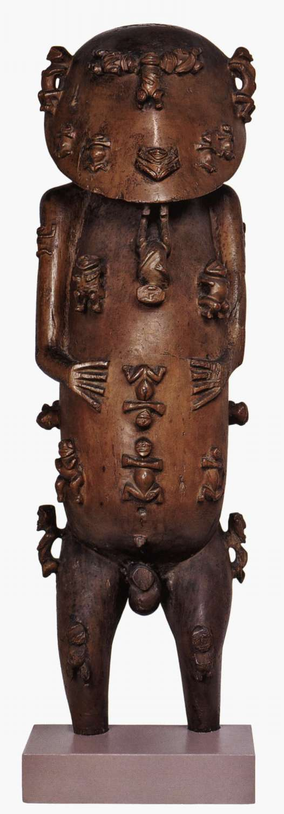

# Тысячеликий герой.
## Глава I. Эманации
### 4.Животворное пространство

Первым действием, исходящим от космогонической эманации, служит формирование мировых стадий пространства, вторым - зарождением жизни внутри этой структуры: жизнь поляризуется и воспроизводит сама себя как двуединство мужского и женского начала. С физиологической точки зрения весь этого процесс можно представить как зачатие и рождение. Эта идея выразительно передана в другой метафизической генеталогии маори:

*Из зачатия - рост,*

*Из роста - мысль,*

*Из мысли - воспоминание,*

*Из создания - желание.*

*Слово стало порождающим;*

*Оно соединилось со смутным мерцанием;*

*Оно породило ночь:*

*Великую ночь, долгую ночь,*

*Нижайшую ночь, высочайшую ночь,*

*Ночь, сгустившуюся, чтобы её можно было чувствовать,*

*Ночь, которой можно коснуться,*

*Ночь, которую нельзя видеть,*

*Ночь, которая кончается в смерти.*

*Из ничто - порождение,*

*Из ничто - возрастание,*

*Из ничто - изобилие,*

*Сил роста,*

*Жизненное дыхание.*

*Оно соединилось с пустотой пространства и породило*

*воздушную сферу над нами.*

*Воздушная сфера, плывущая над землёй,*

*Великий небесный свод над нами*

*Соединиламь с пылающим небом,*

*И отсюда произошло солнце;*

*Луна и солнце поднялись вверх*

*как главные глаза и неба;*

*Затем Небеса стали светом:*

*раннним рассветом, утром дня;*

*Затем был полдень, яркий свет дня, исходящий из неба,*

*Небо над нами соединилось с Гавайки*

*и породило землю²².

##### ²²Richard Wilhem, *Chinesische Marchen* (Jena: Eugen Diederichs Verlag, 1921), рр.29-31.

В середине XIX столетия великий вождь полинезийского острова Анаа по имени Пайоре нарисовал картину, где изображалось начало творения. Первой деталью этого рисунка был маленький круг, содержащий два элемента; это Те Туму, «Основание» (мужское начало), и Те Папа, «Напластвование -Скала» (женское начало)²³.

##### ²³. Маленький кружок под главной фигурой на ил.59. Сравним с китайским Дао или *инь-ян*; см. с.131.

---
                                                                 Автор: Джозеф Кэмпбелл
                                            
         

##### **Таганроаа, порождающий богов и людей(деревянная скульптура). Остров Руруту,начало XVIII в.н.э.**
# The thousand-faced hero.
## Chapter I. Emanations
###4. Life-giving space

The first action emanating from the cosmogonic emanation is the formation of the world stages of space, the second is the birth of life within this structure: life is polarized and reproduces itself as a duality of male and female principles. From a physiological point of view, this whole process can be represented as conception and birth. This idea is expressively conveyed in another metaphysical genealogy of Maori:

* From conception - growth,*

* From growth - thought,*

* From a thought - a memory,*

* From creation - desire.*

*The word has become generative;*

* It connected with a vague flicker;*

* It gave birth to the night:*

* Great night, long night,*

* The lowest night, the highest night,*

* The night, thickened so that it could be felt,*

*A night that can be touched,*

* The night that cannot be seen,*

* The night that ends in death.*

* From nothing - generation,*

*From nothing - increasing,*

* From nothing - abundance,*

*Growth forces,*

* Vital breath.*

* It connected with the emptiness of space and gave birth to*

*the air sphere above us.*

*An air sphere floating above the ground,*

* The great vault of heaven above us*

*Connect with the burning sky,*

* And from here came the sun;*

* The moon and the sun rose up*

*as the main eyes and palate;*

* Then the heavens became light:*

* early dawn, morning of the day;*

*Then it was noon, the bright light of day coming from the sky,*

*The sky above us has connected with Hawaiki*

* and gave birth to the earth22.

In the middle of the XIX century, the great leader of the Polynesian island of Anaa named Payore painted a picture depicting the beginning of creation. The first detail of this drawing was a small circle containing two elements; these are Te Tumu, the "Base" (masculine), and Te Papa, the "Naplastovanie -Rock" (feminine)23.

##### ²³. The small circle under the main figure on fig.59. Is comparable to the Chinese Tao or *yin-yang*; see p.131.

---
Author: Joseph Campbell

##### **Taganroaa, generating gods and people (wooden sculpture). Rurutu Island, the beginning of the XVIII century AD.**

### Сайт Вики с описанием книги:
https://ru.wikipedia.org/wiki/Тысячеликий_герой 
### Сайт чтения онлайн
https://stroki.mts.ru/book/4728?active=book&utm_source=yandex&utm_medium=cpc&utm_campaign=abs_servisy_stroki_content_search_rf&utm_content=product:mts_stroki%7Cagency:abs%7Csrc:search%7Ccgn_in:79064130%7Ccgn_type:brand%7Cgid:5061062987%7Caid:12963392167%7Cph:41762463587%7Cdvc:desktop%7Cloc:Петропавловск-Камчатский%7Creg:78&utm_term=тысячеликий%20герой&_openstat=ZGlyZWN0LnlhbmRleC5ydTs3OTA2NDEzMDsxMjk2MzM5MjE2Nzt5YW5kZXgucnU6cHJlbWl1bQ&yclid=9465259925603614719